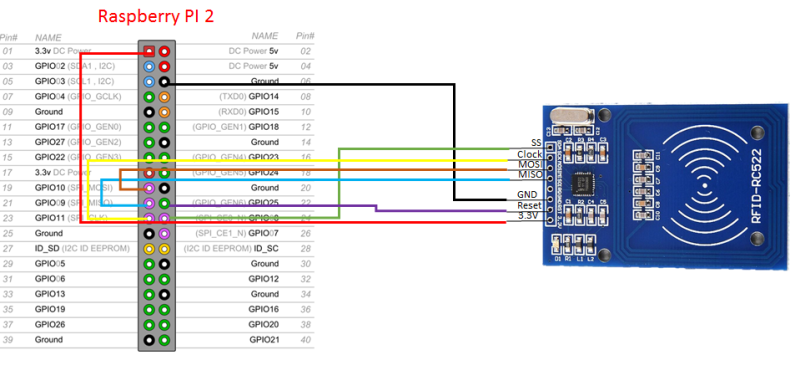

# 🎵 PrimerPi

This project is a screen-free audio player for kids. It allows you to associate RFID tags with audio files and play them when the corresponding tag is scanned.


A few disclaimers:

- 🚨 PrimerPi is a DIY copycat of the [toniebox](https://tonies.com/en-eu/mainpage/) and the [Yoto player](https://uk.yotoplay.com/), though probably more expensive to build and not as good.
- 🥧 I built this on a Raspberry Pi 4 and used [balena](https://www.balena.io/) to deploy and manage the application. It is absolutely overengineered, you can easily replicate the same functionality with a microcontroller. I just happened to have a spare Pi lying around and a bunch of audio code for I could reuse from previous projects.
- 🏴‍☠️ Something something about not pirating audio content.
- 🤖 This project, including this README file, was primarily generated by Claude AI. It's really messy, it may contain bugs, inconsistencies, or suboptimal implementations. Use at your own risk and feel free to improve upon it as needed.


## 🛠️ Hardware required

- Raspberry Pi (any model will do)
- [RC522 RFID Reader module](https://www.amazon.com/SunFounder-Mifare-Reader-Arduino-Raspberry/dp/B07KGBJ9VG)
- RFID tags
- Speaker or audio output device - any speaker using the Raspberry Pi's 3.5mm audio jack will work
- [Rotary Encoder](https://www.amazon.com/Taiss-KY-040-Encoder-15%C3%9716-5-Arduino/dp/B07F26CT6B/ref=sr_1_3?dib=eyJ2IjoiMSJ9._s_FAhQr5PXlpTlOwNHvq6XoYKAoXc20qO9fivpjUGWIzv1MgTqHtneA8uwxRqXCeLP7nw-_GvIipXieABtLnMfh-DAJeJSPxNqvhb1LFkwv8r0xZCP58uvJF85soO4Id3jKn1MjWzAyTk5VHh-P0OAP1lXb0RRe9Gp0UJ_CasTT2IpTL_-FG_PZJ0wHbiJ35Lo8tBf9pztyykBvu--_1gvscBOG6y4ddTWFcmo5cbo.WfvCW9z73RpOBNpV3W0jLOp5rC4pTq9lUVlrdJqqNOc&dib_tag=se&keywords=rotary+encoder&qid=1729687909&sr=8-3)(optional)


## 🧩 Components

The system consists of several components:

1. **RFID Reader**: A script that continuously scans for RFID tags using an RC522 RFID module.
2. **Audio Player**: A service responsible for playing audio files when triggered.
3. **Server**: A Node.js server that manages the RFID-to-audio file mappings and coordinates communication between components.
4. **Web Interface**: A simple web page for managing audio content and the RFID-to-audio file mappings.
5. **Rotary Encoder**: Allows you to control the volume of the audio player and stop playback.

## 🛠️ Setup

### Hardware Setup

Connect the RC522 sensor using the following diagram as a guide:


If you're using a rotary encoder, connect it as follows:
- GPIO 17 -> Encoder pin SW
- GPIO 22 -> Encoder pin CLK
- GPIO 27 -> Encoder pin DT

Note that these are not pin numbers but Raspberry Pi GPIO numbers.

### Software Setup

This project uses balena to deploy the application to the Raspberry Pi. If you're not familiar with balena, you should [check it out](https://docs.balena.io/learn/welcome/introduction/) - it's a great platform for IoT device management. You are going to need to:
- Create a balena account
- Install the [balena CLI](https://docs.balena.io/reference/balena-cli/#install-the-cli)
- Create a new application on the [Balena dashboard](https://dashboard.balena-cloud.com/)

Then:
1. Clone this repository to your local machine.
2. Login to the balena CLI:
   ```
   balena login
   ```
3. Push the code to your Balena application:
   ```
   balena push <your-application-name>
   ```

Wait for the build to complete on your machine and the deployment to be completed. Once the build is uploaded to balenaCloud, the application will be deployed to your Raspberry Pi automatically.

If you're not using balena, you can still deploy this application manually to your Raspberry Pi. You'll need to set up Docker and Docker Compose on your Pi, then clone this repository and run `docker-compose up` in the project directory. Note that you might have to rename and edit the `Dockerfile.template` files to remove any usage of balena env vars like `%%BALENA_ARCH%%`.

## 🎯 Usage

1. Access the web interface by navigating to `http://<raspberry-pi-ip>:3000` in a web browser.
2. Use the web interface to add, edit, or remove RFID-to-audio file mappings.
3. Scan an RFID tag near the RC522 module. The system will automatically play the associated audio file.
4. Optionally, use the rotary encoder to control the volume and stop playback by pressing the button.

## 🤝 Contributing

Contributions to improve the project are welcome. Please fork the repository and submit a pull request with your changes.

## 📄 License

This project is open-source and available under the MIT License.
